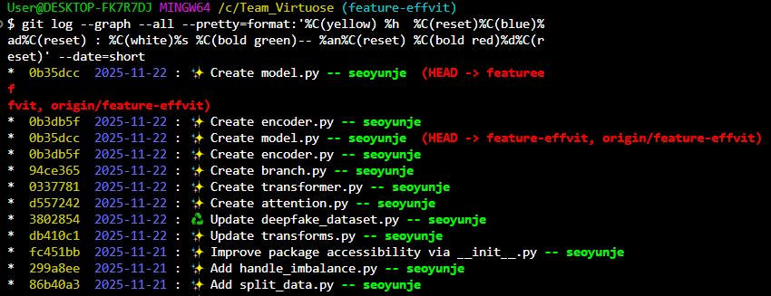

## 옵션들을 활용한 다양한 사용법

이번 파트에선 git log에 대해 보다 심도 있게 다루어보았다

 

### **<ins/>_가장 대표적인 사용법_</ins>**

```bash
git log
```

### **<ins/>_최근 n개의 commit만 보기_</ins>**

```bash
git log -(갯수)
```

### **<ins/>_각 커밋마다의 변경사항 함께 보기_</ins>**

```bash
git log -p
```

### **<ins/>_최근 n개의 commit마다의 변경사항 함께 보기_</ins>**

```bash
git log -p -(갯수)
```

### **<ins/>_통계와 함께 보기_</ins>**

```bash
git log --stat
git log --shortstat # 더 간략히
```

### **<ins/>_한줄로 보기_</ins>**

```bash
git log --oneline
git log --oneline -(갯수)
```

### **<ins/>_변경사항 내 단어 검색_</ins>**

```bash
git log -S (검색어)
```

### **<ins/>_커밋 메시지로 검색_</ins>**

```bash
git log --grep (검색어)
git log --grep (검색어) -(갯수)
```

### **<ins/>_자주 사용되는 그래프 로그 보기_</ins>**

```bash
git log --all --decorate --oneline --graph
```

|  |  |
| -------- | ------- |
| `--all`  | 모든 브랜치 보기 |
| `--decorate`  | 브랜치, 태크 모든 레퍼런스 표시 |
| `--graph`  | 그래프 표현 |
| `--oneline`  | 한줄로 보기 |

### **<ins/>_나만의 포맷 방식_</ins>**

```bash
git log --graph --all --pretty=format:'%C(yellow) %h  %C(reset)%C(blue)%ad%C(reset) : %C(white)%s %C(bold green)-- %an%C(reset) %C(bold red)%d%C(reset)' --date=short
```

**출력 예시**

